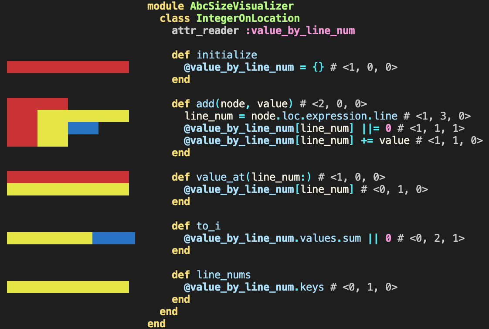

# AbcSizeVisualizer

```bash
$ gem install abc_size_visualizer
$ visualize_abc_size some_code.rb
# prints size of 1)assignment 2)branch 3)condition with code.
# red means assignment, yellow means branch, blue means condition
```



## Contributing

Bug reports and pull requests are welcome on GitHub at https://github.com/genya0407/abc_size_visualizer.

## License

The gem is available as open source under the terms of the [MIT License](https://opensource.org/licenses/MIT).
